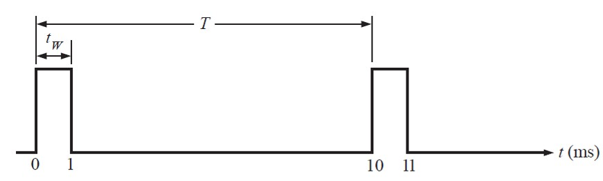

# Lab01: Sistemas Numéricos y Señales Digitales

## Contenido
- Objetivos de aprendizaje  
- Fundamento teórico  
- Procedimiento  
- Descripción del entorno conceptual  
- Entregables  

---

## 1. Objetivos de aprendizaje

Al finalizar esta práctica, el estudiante será capaz de:

- Convertir números entre base 2, 8, 10 y 16.
- Comprender el concepto de **peso posicional** en sistemas numéricos.
- Identificar MSB, LSB, bit, nibble y byte.
- Calcular **período (T)**, **frecuencia (f)** y **ciclo de trabajo (D)**.
- Interpretar diagramas de tiempo de señales digitales.
- Relacionar los conceptos matemáticos con señales digitales reales.

---

## 2. Fundamento teórico

### 2.1 Sistemas de numeración

Un sistema de numeración está definido por su base y el peso posicional de cada dígito.

En electrónica digital se utilizan principalmente:

- Base 2 (binario)
- Base 10 (decimal)
- Base 8 (octal)
- Base 16 (hexadecimal)

En sistema binario:

Cada posición representa una potencia de 2.

Ejemplo:

10110₂ =  
1·2⁴ + 0·2³ + 1·2² + 1·2¹ + 0·2⁰

---

### 2.2 Tamaño de palabra y representación

- 1 bit = unidad mínima de información.
- 4 bits = 1 nibble.
- 8 bits = 1 byte.
- n bits = palabra (word).

MSB (Most Significant Bit): bit de mayor peso.  
LSB (Least Significant Bit): bit de menor peso.

El número máximo representable con n bits sin signo es:

2ⁿ − 1

---

### 2.3 Señales digitales periódicas

Una señal digital ideal tiene dos niveles lógicos:

- Nivel bajo (0)
- Nivel alto (1)

Las señales periódicas se caracterizan por:

- Período (T): tiempo que tarda en repetirse un ciclo.
- Frecuencia (f): número de ciclos por segundo.
- Ciclo de trabajo (D): porcentaje de tiempo que la señal permanece en nivel alto.

Relaciones fundamentales:

f = 1 / T  
T = 1 / f  
D = Ton / T  

Donde:

T = Ton + Toff  

---

## 3. Procedimiento

### 3.1 Parte A – Conversión de bases

Realice las siguientes conversiones mostrando procedimiento:

1. 93₁₀ → binario  
2. 110101₂ → decimal  
3. 0x2F → binario  
4. 0x2F → decimal  
5. 357₈ → decimal  
6. 255₁₀ → binario (8 bits)

Adicionalmente responda:

- ¿Cuántos bits se requieren para representar 500₁₀ en binario?
- ¿Cuál es el valor máximo representable con 6 bits sin signo?

---

### 3.2 Parte B – Cálculo de señales

Se tiene una señal con:

- Ton = 4 ms  
- Toff = 6 ms  

Calcule:

- Período total
- Frecuencia
- Ciclo de trabajo (%)

---

Se tiene un reloj con:

- f = 25 MHz  

Calcule:

- Período en segundos
- Período en nanosegundos
- Ton y Toff si el duty cycle es 50%

---

### 3.3 Parte C – Interpretación de diagrama de tiempo

A partir del diagrama determine:

- Período
- Frecuencia
- Ciclo de trabajo

---

### 3.4 Parte D – Reflexión conceptual

Responda brevemente:

1. ¿Por qué los sistemas digitales utilizan base 2?
2. ¿Por qué el reloj es fundamental en sistemas secuenciales?
3. ¿Qué ocurre si una señal tiene un duty cycle muy pequeño?

(Máximo 3 líneas por pregunta)

---

## 4. Descripción del entorno conceptual

En esta práctica no se requiere el uso de HDL ni herramientas de simulación.

Sin embargo, los conceptos estudiados aquí serán fundamentales para:

- Representación numérica en Verilog.
- Definición de tamaños de palabra.
- Comprensión del comportamiento temporal de señales de reloj.
- Diseño de sistemas secuenciales en prácticas posteriores.

---

## 5. Entregables

- Documento `README.md` con:
  - Todas las conversiones realizadas con procedimiento.
  - Cálculos completos de período, frecuencia y duty cycle.
  - Respuestas conceptuales.
  - Interpretación del diagrama de tiempo.

No se requiere código en esta práctica.

---

## Recursos adicionales
- Libro: Fundamentos de Sistemas Digitales – Floyd
- Apuntes de clase sobre sistemas numéricos
