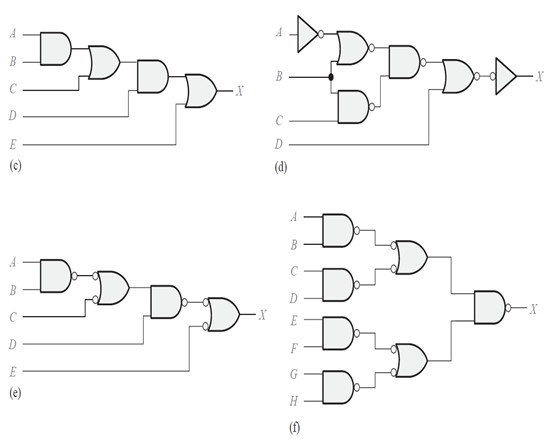

# Lab03: Diseño modular y jerárquico / Diagramas de flujo

## Contenido
- Objetivos de aprendizaje  
- Fundamento teórico  
- Procedimiento  
- Descripción del enfoque de diseño  
- Entregables  

---

# 1. Objetivos de aprendizaje

Al finalizar esta práctica, el estudiante será capaz de:

- Interpretar circuitos lógicos a partir de diagramas de compuertas.
- Obtener expresiones booleanas a partir de un circuito dado.
- Simplificar funciones lógicas cuando sea posible.
- Representar el comportamiento de un sistema digital mediante diagramas de flujo.
- Identificar variables de entrada y salida en una especificación funcional.
- Construir tablas de verdad completas.
- Obtener expresiones lógicas a partir de una descripción verbal.
- Diseñar circuitos combinacionales usando compuertas lógicas.
- Comprender la relación entre especificación funcional, lógica booleana y hardware.
- Preparar la transición hacia la implementación en HDL.

---

# 2. Fundamento teórico

## 2.1 Especificación funcional en sistemas digitales

El diseño de un sistema digital comienza con la definición de su comportamiento.

Toda especificación funcional debe responder a las siguientes preguntas:

- ¿Cuáles son las entradas del sistema?
- ¿Cuál es la salida del sistema?
- ¿Qué condiciones deben cumplirse para activar cada salida?
- ¿Qué decisiones lógicas toma el sistema?

Antes de construir un circuito, es indispensable entender **qué debe hacer el sistema**.

---

## 2.2 Diagramas de flujo

Un diagrama de flujo permite representar gráficamente el comportamiento de un sistema o algoritmo.

Símbolos más utilizados:

| Símbolo | Significado |
|--------|-------------|
| Óvalo | Inicio / Fin |
| Rectángulo | Proceso |
| Rombo | Decisión |
| Paralelogramo | Entrada / salida |
| Flecha | Flujo |

En sistemas digitales, las decisiones del diagrama representan condiciones lógicas que posteriormente se traducen en expresiones booleanas.

---

## 2.3 Tablas de verdad

Una tabla de verdad describe todas las combinaciones posibles de las entradas y la salida correspondiente del sistema.

Para un sistema con **n entradas**, el número de combinaciones posibles es:

2^n

La tabla de verdad permite verificar formalmente el comportamiento del sistema antes de construir el circuito.

---

## 2.4 Circuitos combinacionales

Un circuito combinacional es aquel cuya salida depende únicamente del valor actual de sus entradas.

Estos circuitos pueden implementarse mediante compuertas lógicas como:

- AND
- OR
- NOT
- NAND
- NOR
- XOR

---

## 2.5 Diseño modular y jerárquico

Un sistema digital complejo puede dividirse en partes más pequeñas y manejables.

Este enfoque permite:

- analizar mejor el problema
- separar condiciones lógicas
- reutilizar bloques
- facilitar la transición a HDL

---

# 3. Procedimiento

La práctica se desarrollará en dos etapas.

---

## Etapa 1 — Análisis de circuitos dados

A partir de los circuitos adjuntos, el estudiante deberá:

1. Identificar las compuertas utilizadas.
2. Obtener la expresión lógica de salida.
3. Simplificar la expresión si es posible.
4. Justificar brevemente el procedimiento.

---

## Etapa 2 — Diseño a partir de especificación funcional

Para cada ejercicio planteado, el estudiante deberá:

1. Identificar entradas y salidas.
2. Diseñar el diagrama de flujo del sistema.
3. Construir la tabla de verdad completa.
4. Obtener la expresión lógica de la salida.
5. Dibujar el circuito lógico usando compuertas.
6. Explicar brevemente el funcionamiento del sistema.

---

# 4. Parte A – Ejercicio previo de análisis lógico

Antes de diseñar sistemas nuevos, analice los circuitos lógicos mostrados en la figura adjunta.

## Actividad

Para cada circuito mostrado:

1. Encuentre la expresión lógica de salida.
2. Simplifique la expresión si es posible.
3. Indique qué tipo de compuertas aparecen en el diseño.
4. Describa brevemente la estructura lógica observada.

### Circuitos a analizar

**Nota:**  
No es necesario redibujar los circuitos. Sin embargo, el desarrollo debe mostrar claramente cómo se obtuvo la expresión lógica a partir del diagrama.

---

# 5. Parte B – Diseño de sistemas digitales a partir de especificaciones

---

## 5.1 Ejercicio 1 — Sistema de autorización

Un sistema electrónico permite activar un mecanismo solo si se cumplen ciertas condiciones.

### Entradas

A → tarjeta válida  
B → código correcto  

### Salida

OPEN

### Condición

El sistema se activa únicamente si **ambas condiciones son verdaderas**.

### Actividades

1. Diseñar el diagrama de flujo.
2. Construir la tabla de verdad.
3. Obtener la expresión lógica.
4. Dibujar el circuito lógico.

---

## 5.2 Ejercicio 2 — Sistema de alerta ambiental

Un sistema monitorea condiciones ambientales en un laboratorio.

### Entradas

T → temperatura alta  
H → humedad alta  

### Salida

ALERT

### Condición

La alerta se activa si **al menos una condición es peligrosa**.

### Actividades

1. Diseñar el diagrama de flujo.
2. Construir la tabla de verdad.
3. Obtener la expresión lógica.
4. Dibujar el circuito lógico.

---

## 5.3 Ejercicio 3 — Autorización de despegue

Un sistema de control permite el despegue de una aeronave solo si se cumplen todas las condiciones de seguridad.

### Entradas

A → puertas cerradas  
B → pista autorizada  
C → motores listos  

### Salida

TAKEOFF_OK

### Condición

El despegue se permite solo si **todas las condiciones son verdaderas**.

### Actividades

1. Diseñar el diagrama de flujo.
2. Construir la tabla de verdad.
3. Obtener la expresión lógica.
4. Dibujar el circuito lógico.

---

## 5.4 Ejercicio 4 — Sistema inteligente de arranque de dron

Un dron solo puede iniciar su sistema de vuelo si se cumplen ciertas condiciones de seguridad y operación.

### Entradas

B → batería suficiente  
G → señal GPS válida  
C → brújula calibrada  
P → piloto autorizado  
E → botón de emergencia activo  

### Salida

START

### Condiciones

El dron puede iniciar el vuelo únicamente si:

- la batería tiene carga suficiente
- el piloto está autorizado
- existe señal GPS válida **o** la brújula está calibrada
- el botón de emergencia **no está activado**

### Actividades

1. Identificar claramente todas las condiciones lógicas del sistema.
2. Diseñar el diagrama de flujo.
3. Construir la tabla de verdad completa.
4. Obtener la expresión lógica de la salida.
5. Dibujar el circuito lógico utilizando compuertas.
6. Indicar qué subbloques lógicos pueden identificarse en el diseño.

---

# 6. Descripción del enfoque de diseño

En esta práctica no se utilizará HDL ni herramientas de síntesis.

El trabajo se centrará en:

- interpretación de circuitos lógicos
- diagramas de flujo
- tablas de verdad
- obtención de expresiones booleanas
- diseño de circuitos combinacionales

La práctica busca consolidar la idea de que un sistema digital no se diseña directamente en código, sino que parte de una especificación funcional clara.

---

# 7. Entregables

El archivo `README.md` debe incluir:

## Parte A

Para cada circuito:

- expresión lógica obtenida
- simplificación (si aplica)
- breve justificación

## Parte B

Para cada ejercicio:

- identificación de entradas y salidas
- diagrama de flujo
- tabla de verdad completa
- expresión booleana
- circuito lógico
- explicación breve del funcionamiento del sistema

---

## Reflexión final

Responder en máximo **8 líneas**:

¿Qué ventaja tiene describir primero el comportamiento del sistema antes de construir el circuito lógico?

---

# 8. Recomendaciones de desarrollo

- Use notación booleana consistente.
- Nombre claramente las variables.
- Dibuje los circuitos de forma ordenada.
- Verifique siempre que la tabla de verdad coincida con la especificación verbal.

---

# 9. Observaciones para el estudiante

En esta práctica se espera que el estudiante conecte los siguientes niveles de representación:

Problema  
→ Diagrama de flujo  
→ Tabla de verdad  
→ Expresión lógica  
→ Circuito
